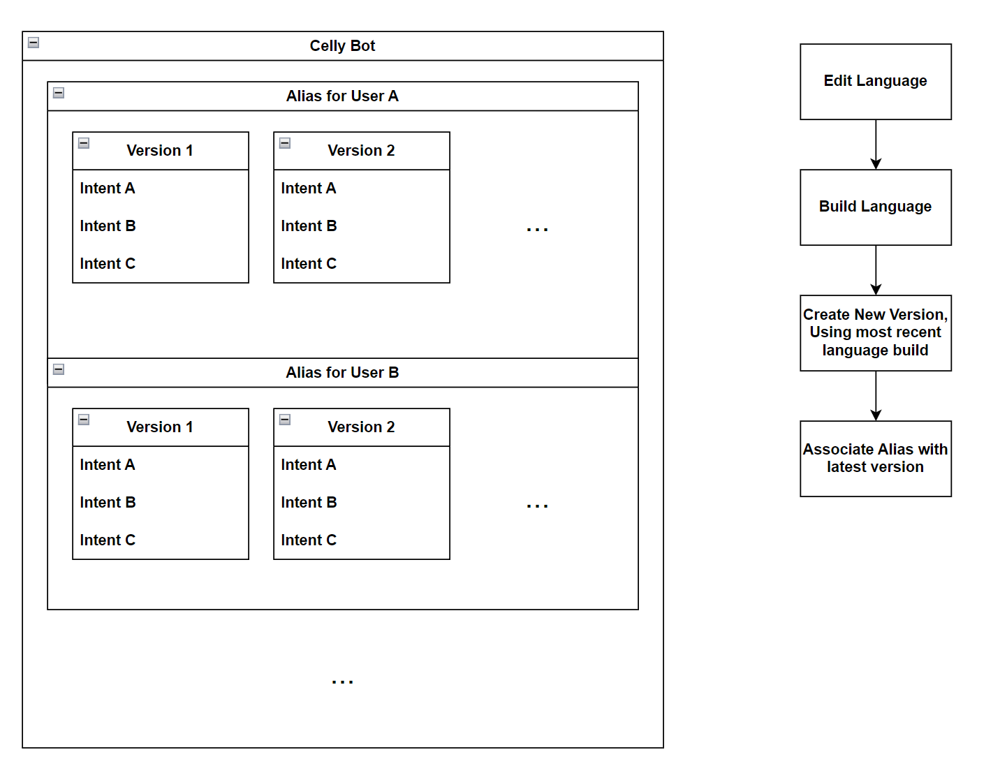
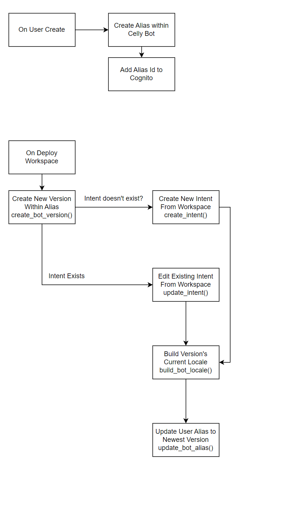

# Celly Auto SMS

Automated text messaging system.

[The GANNT Chart](https://docs.google.com/spreadsheets/d/1BHNAObOwO4VI0TWgIXEIb1LyrxmVR_9PMCc-vQX5WZY/edit#gid=0)

## Todo Board

Done:

- [x] Register for Toll Free Number
- [x] /user/login
- [x] /user/resend_code
- [x] Fix sending Access Token, not working for getUser
- [x] Attatch microsoft graph api to cognito
- [x] Toll free number acquired
- [x] Build out UI for login and register
- [x] Fix token only working for one action issue.
- [x] Fix checking if token expired.
- [x] Expiration check for JWT Authorizer.


---

In progress:

- [ ] Tie backend to frontend.
- [ ] Write out API docs for User & Other functions

---

To Do:

- [ ] Build out UI for the side bar of both cells.
- [ ] Build landing page.
- [ ] Remove workspace description, not needed.
- [ ] Migrate workspace metadata over to S3 Metadata and remove table.
- [ ] Add versioning to workspaces and workspace deployments

### Diagrams




### Authorization URL For Azure AD Authentication

```
https://celly-microsoft-pool.auth.us-east-1.amazoncognito.com/oauth2/authorize?identity_provider=cellymicrosoftpool&redirect_uri=http://localhost:5173&response_type=TOKEN&client_id=5dfi8s06l6ephu5e5c6vri4aqe&scope=email openid phone
```
